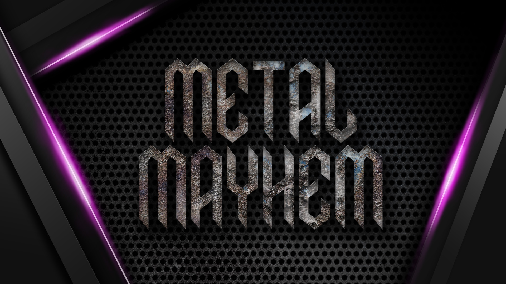

    

<!-- 
 --> 
In a neon-soaked dystopian future where technology and anarchy collide, only the strongest will rise victorious.
<!-- 
 -->

Immerse yourself in a visual masterpiece that marries cutting-edge graphics with nostalgic pixel art, transporting you to a future that pays homage to the glory days of arcade gaming. From neon-lit back alleys to towering skyscrapers crumbling in the wake of your devastation, every frame is a work of art that encapsulates the essence of a bygone era.

As the heavy metal soundtrack surges through your veins, propelling you forward in the relentless pursuit of justice, you'll experience a rush like no other. The stakes are high, the challenges are relentless, and the adrenaline-fueled action is non-stop.

Are you ready to enter a realm of Metal Mayhem? The battle cries of fallen warriors echo in the winds, beckoning you to rise as the ultimate champion. Sharpen your blade, charge your energy, and prepare to unleash a storm of unbridled chaos. 

    

